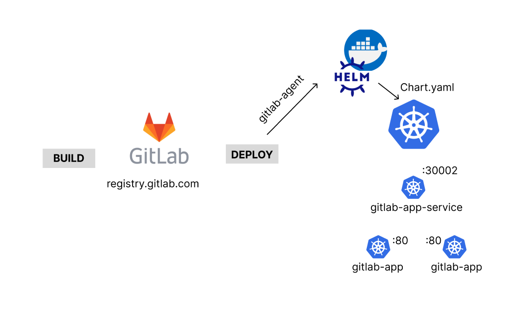
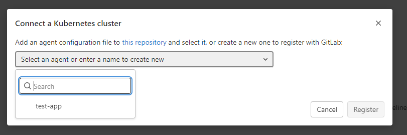
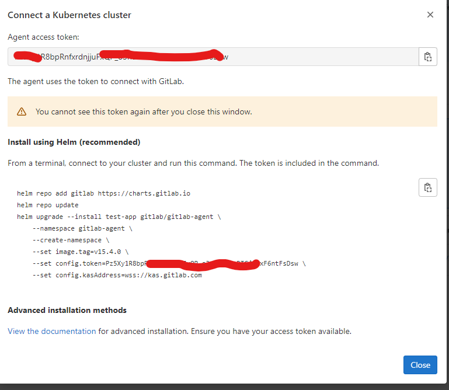
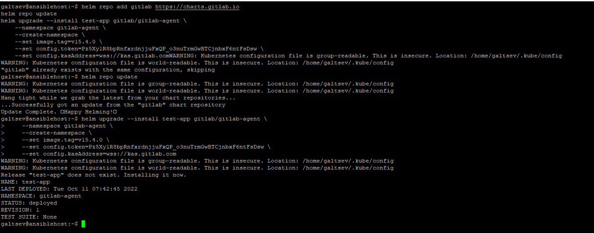
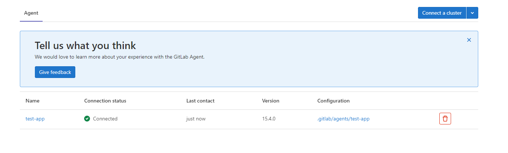
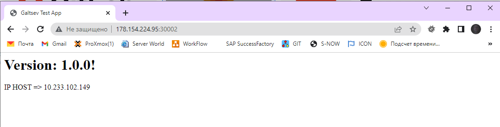
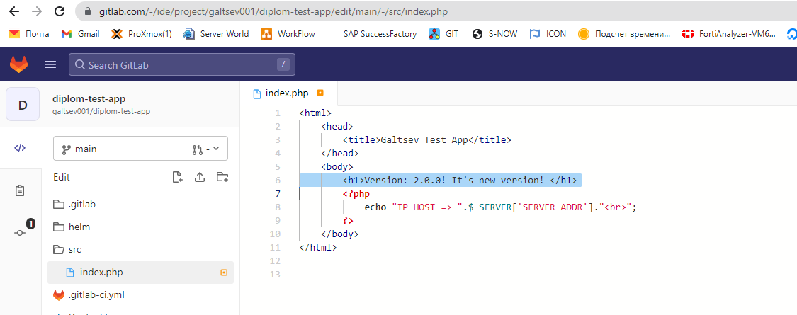
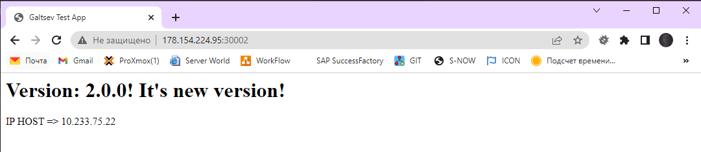
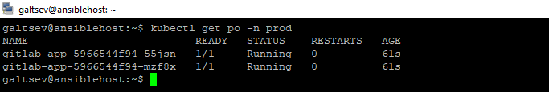

## Установка и настройка CI/CD

* [Схема CI/CD](#схемв-cicd)
* [Установка gitlab-agent для kubernetes](#установка-gitlab-agent-для-kubernets)
* [Написание инструкции](#написание-инструкции)
* [Проверка работы](#проверка-работы)
* [Ссылки](#ссылки)

---
##### Схемв CI/CD

Для автоматизации процессов CI/CD была выбрана следующая схема:




Описание схемы:

+ Если репозиторий получал изменения в ветке `main` или создавался новый `tag`, то запускался `piplene` с двумя задачами `stage`:
    + **BUILD** - здесь, основная работа в сборке проекта в контейнер и записи его в систему хранения контейнеров платформы `GITLAB`
    + **DEPLOY** - здесь, при помощи подключенного агента gitlab c нашим кластером, запускался docker образ, который запускал helm чарт для создания/обновления сервисов и приложения из системы хранения контейнеров (который уже должен собраться к этому времени). 

+ Ссылка на [Helm Chart](./config/helm/README.md), который будет использоваться для CI/CD процессов

##### Установка gitlab-agent для kubernets 

Для начала работы необходимо подключить gitlab-agent для Kubernetes. Чтобы это сделать необходимо:

1. Создать конфиг файл агента в корне проекта такого вида
```bash
.gitlab/agents/<name agent>/config.yaml
#В моем примере выглядит так
.gitlab/agents/test-app/config.yaml
```
2. Указываем минимальную конфигурацию для агента в файле `config.yaml`
```bash
gitops:
  manifest_projects:
  - id: galtsev001/diplom-test-app/ #путь до нашего проекта
    default_namespace: prod         #по умолчанию используется наймспейс прод
    paths:
    - glob: '/**/*.{yaml,yml,json}' #во всех каталогах будут искаться файлы данных расширений
```
3. Переходим во вкладку Infrastructure -> Kubernetes clusters. Нажимаем кнопку добавить агента и выбираем из выпадающего списка созданного агента:




4. Далее появляется окно с инструкцией установки и подключения агента на kubernetes



5. Копируем предлагаемую строку `Install using Helm` и вставляем на локальную машину, где у нас подключен `kubectl` с доступом к кластеру. Результат ниже:



6. Переходим в Gitlab и проверяем что агент подключен (Infrastructure -> Kubernetes clusters).



##### Написание инструкции

Дополним ранее созданный `.gitlab-ci.yml` инструкцией по обновлению приложения на кластере `kubernetes`. Для этого создадим еще одну стадию `deploy`. Полный вывод файла ниже:

```yaml
image: docker:latest
services:
 - docker:dind
stages: 
 - build
 - deploy

build:
  image: docker:20.10.16
  stage: build
  services:
    - docker:20.10.16-dind
  script:
    - docker login -u $CI_REGISTRY_USER -p $CI_REGISTRY_PASSWORD $CI_REGISTRY
    - docker build -t $CI_REGISTRY/galtsev001/diplom-test-app:latest .
    - docker push $CI_REGISTRY/galtsev001/diplom-test-app:latest
  only:
    - main
    - tags
deploy:
  stage: deploy
  image:
    name: lwolf/helm-kubectl-docker:latest
    entrypoint: ['']
  before_script:
    - kubectl config use-context galtsev001/diplom-test-app:test-app
  script:
    - set imag=$CI_REGISTRY_IMAGE:$CI_COMMIT_REF_NAME helm/templates/deployment.yaml | helm upgrade --recreate-pods gitlab-app helm --install
  only:
    - main
    - tags
```
Build и deploy начинают работать если есть изменения ветки main или внесен новый tag

##### Проверка работы

Проверим приложение до изменений на kubernetes на порту 30002



Сделаем изменения в файле index.php в папке src. Изменим версию и добавим предложение `It's new version!` и сделаем коммит в ветке `main`



После того как отработает `pipeline` обновим страницу в браузере и увидим наши изменения:



Убедимся что поды созданы в `namespace` **prod**



##### Ссылки

+ Ссылка на [тестовое приложение для деплоя](http://178.154.224.95:30002)
+ Ссылка на [репозиторий тестового приложения для деплоя](https://gitlab.com/galtsev001/diplom-test-app) 
+ Ссылка на отработанный [pipeline](https://gitlab.com/galtsev001/diplom-test-app/-/jobs/3159921943)
+ [Описание Helm чарта](./config/helm/README.md)

---

[На главную](../README.md#установка-и-настройка-cicd)

