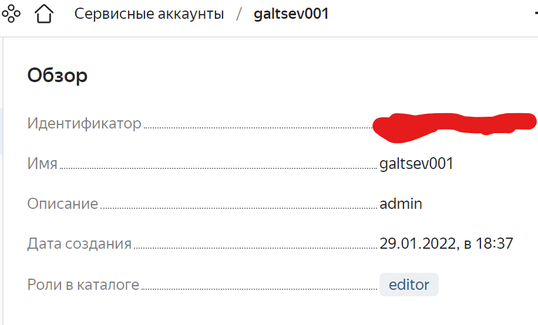
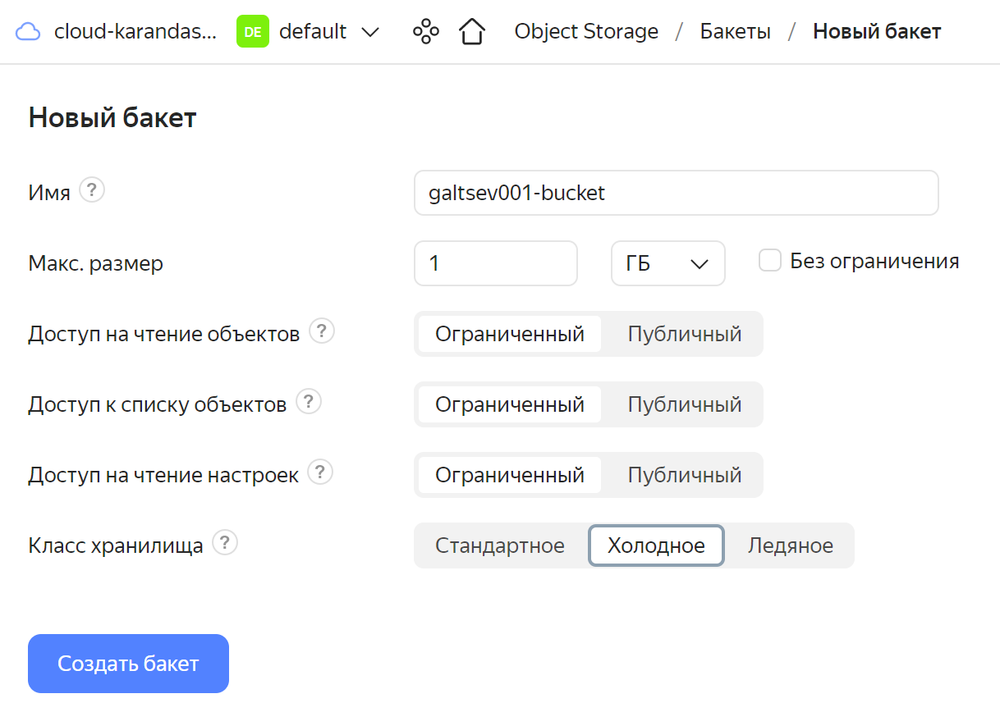
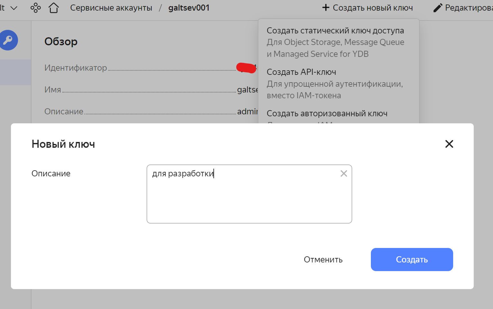
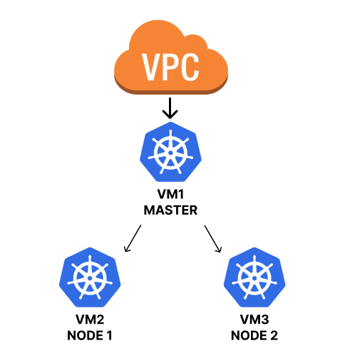
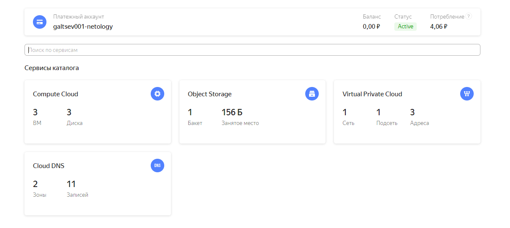
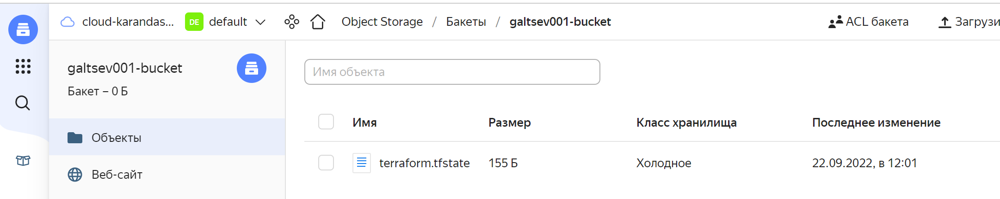

## Создание облачной инфраструктуры

* [Создание сервисной учетной записи](#создание-сервисной-учетной-записи)
* [Создание Yandex Object Storage](#создание-yandex-object-storage)
* [Создание файлов конфигурации](#создание-файлов-конфигурации)
* [Запуск конфигурации и проверка](#запуск-конфигурации-и-проверка)
* [Экспорт/Импорт данных Yandex Object Storage](#создание-yandex-object-storage)
___

##### Создание сервисной учетной записи

Сервисный аккаунт необходим для управления ресурсами `Yandex Cloud`. От его имени также будем производить доступ к `Yandex Object Storage` для получения файла состояния (явки пароли для подключения)
Проверил в консоль Yandex Cloud у меня уже создана учетная запись, воспользуемся ей:



##### Создание Yandex Object Storage

+ Находим пункт Yandex Object Storage
+ Укажем минимальную конфигурацию. Выбираем тип хранения `холодный` т.к. не планируем частое изменение инфраструктуры.



+ Создаем ключ, чтобы использовать его для подключения



##### Создание файлов конфигурации

Для нашей задачи создадим следующее:



[Файлы для TERRAFORM](./config/README.md)

Так как наша задача состоит в составлении скрипта автоматизирующего нашу работу, нам необходимо получить с помощью `terraform` инвентори для `ansible`.
Для этого после развертывания инфраструктуры используем команду `terraform output > output_data.txt`, который на основании шаблона инвентори, создает файл со всеми необходимыми параметрами. За это отвечает эта часть описания файла `main.tf`:

```bash
output "ansible_inventory" {
  value = templatefile("inventory.yml.tpl", {
    master = "${yandex_compute_instance.master.network_interface.0.nat_ip_address}"
    node_1 = "${yandex_compute_instance.node_1.network_interface.0.nat_ip_address}"
    node_2 = "${yandex_compute_instance.node_2.network_interface.0.nat_ip_address}"
    user = "galtsev001"
  })
```
Для удаления лишней информации в файле инвентори (удаление строки `value = `) для `ansible` использую `python` скрипт:

```python
file = open("output_data.txt", "r")
text = file.read()
if text is not None:
    text = text[25:len(text)-4].strip()
    inventory = open("inventory.yml", "w")
    inventory.write(text)
    inventory.close()
file.close()
```

##### Запуск конфигурации и проверка

+ Создаем файл `main.tf`, где описываем все что необходимо создать для инфраструктуры
+ Делаем инициализацию `terraform init`
+ Создаем рабочее пространство `terraform workspace new prod`
+ Запускаем команду `terraform plan` чтобы проверить что будет создано. Ниже краткая выходная информация. Убеждаемся что все ресурсы будут созданы согласно нашему файлу и в конце будут сформированы выходные данные для инвентори `ansible`

```
PS D:\diplom\test> terraform plan

--- // ---

Plan: 6 to add, 0 to change, 0 to destroy.

Changes to Outputs:
  + ansible_inventory = (known after apply)
```

+ Применяем наши изменения `terraform apply`
+ Проверяем что ресурсы созданы в `Yandex Cloud`



##### Экспорт/Импорт данных Yandex Object Storage

После развертывания инфраструктуры видим что файл `terraform.tfstate` записан успешно:



---

[На главную](../README.md#создание-облачной-инфраструктуры)