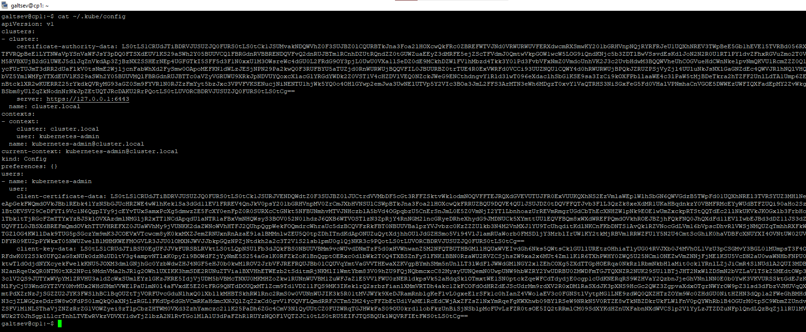

## Создание Kubernetes кластера

* [Установка](#Установка)
* [Настройка подключения к кластеру](#настройка-подключения-к-кластеру)

---

##### Установка

Установка производится при помощи `kubespray`. Для этого клонируем проект из `github` на локальную машину:

```bash
#Копирование на локальную машину проекта kubespray
git clone https://github.com/kubernetes-sigs/kubespray.git
#Установка зависимостей для python
pip3 install -r ./kubespray/requirements.txt
```
Для корректной установки кластера необходимо скопировать папку `./kubespray/inventory/sample/`. Там находятся необходимые переменные и патчи для установки.
С копируем ее в заранее подготовленную папку `inventory`

```bash
cp -r ./kubespray/inventory/sample/* ./inventory
```

Туда вставим заранее подготовленный файл инвентори `inventory.yaml`

```bash
all:
  hosts:
    cp1:
      ansible_host: ip-host-cp1
      ansible_user: user
    node1:
      ansible_host: ip-host-node1
      ansible_user: user
    node2:
      ansible_host: ip-host-node2
      ansible_user: user
  children:
    kube_control_plane:
      hosts:
        cp1:
    kube_node:
      hosts:
        cp1:
        node1:
        node2:
    etcd:
      hosts:
        cp1:
    k8s_cluster:
      children:
        kube_control_plane:
        kube_node:
    calico_rr:
      hosts: {}
```
Запустим установку 

```bash
ansible-playbook -i ./inventory/inventory.yaml  ./kubespray/cluster.yml -b -v
```

После установки видим результат вывода `ansible`


Подключаемся к control panel ноде для проверки состояния кластера.
В моем случае `kubectl` отрабатывал не корректно, помогло следующее:

```bash
mkdir -p $HOME/.kube
sudo cp -i /etc/kubernetes/admin.conf $HOME/.kube/config
sudo chown $(id -u):$(id -g) $HOME/.kube/config
```

После этого видим состояние кластера:




##### Настройка подключения к кластеру

Для доступа кластеру из вне необходимо до запуска установки `ansible` добавить в файл переменные (`k8s-cluster.yml`) (скопированную папку `inventory`) строку типа supplementary_addresses_in_ssl_keys: [**ip address control panel**]
```bash
echo "supplementary_addresses_in_ssl_keys: [10.10.10.10] >> ./inventory/group_vars/k8s_cluster/k8s-cluster.yml"
```
После установки `kubernetes` копируем файл конфигурации `control panel` на локальную машину

```bash
cat ~/.kube/config
```
Всю выводимую информацию сохраняем на локальной машине по такому же пути и под таким же именем. Меняем localhost на ip control panel
Проверяем подключение:


---

[На главную](../README.md)