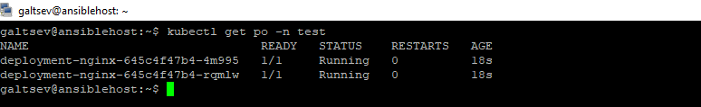

## Подготовка cистемы мониторинга и деплой приложения

* [Установка системы мониторинга](#установка-системы-мониторинга)
* [Деплой приложения](#деплой-приложения)

---
##### Установка системы мониторинга

В качестве готового решения был выбран git репозиторий [kube-prometheus](https://github.com/prometheus-operator/kube-prometheus)
Клонируем в проект на `control panel`

```bash
git clone https://github.com/prometheus-operator/kube-prometheus.git
```

Далее необходимо пере идти в скачанный каталог и применить изменения на кластере

```bash
cd ./kube-prometheus
#пред установка
kubectl apply --server-side -f manifests/setup
until kubectl get servicemonitors --all-namespaces ; do date; sleep 1; echo ""; done
#Установка всех сервисов и модулей
kubectl apply -f manifests/
```

По умолчанию все компоненты устанавливаются в `namespace` **monitoring**. Проверим что все ресурсы созданы:

```bash
kubectl get po -n monitoring -o wide
```


Организуем доступ к графикам системы из вне. Для этого создадим `Service` с типом `NodePort` и изменим сетевую политику. Сервис будет доступен на 30000 порту.
[grafana-service.yaml](./config/grafana-service.yaml). Применим манифест и проверим доступ:

```bash
kubectl apply -f grafana-service.yaml
```


Доступ из браузера:


Внутри развёрнуты готовые дашборды для мониторинга и контроля кластера `kubernets`

##### Деплой приложения

Для тестов работоспособности кластера попробуем создать простое приложение `nginx` и создать `Service` для проверки доступности из вне.

+ Создадим тестовое окружение для экспериментов

```bash
kubectl create namespace test
```
+ Создадим `deployments` c 2м экземплярами (`ReplicaSet = 2`). Файл манифеста [pod.yaml](./config/pod.yaml)

```bash
kubectl apply -f pod.yaml -n test
```
Проверим состояние 



+ Создадим сервис с типом NodePort. Приложение будет доступно на 30001 порту. Файл манифеста [service-test.yaml](./config/service-test.yaml)

```bash
kubectl apply -f service-test.yaml -n test
```

Проверим что сервис создан:


Проверим доступность:


[Ссылка](http://178.154.224.95:30001) на тестовое приложение

---

[На главную](../README.md)


