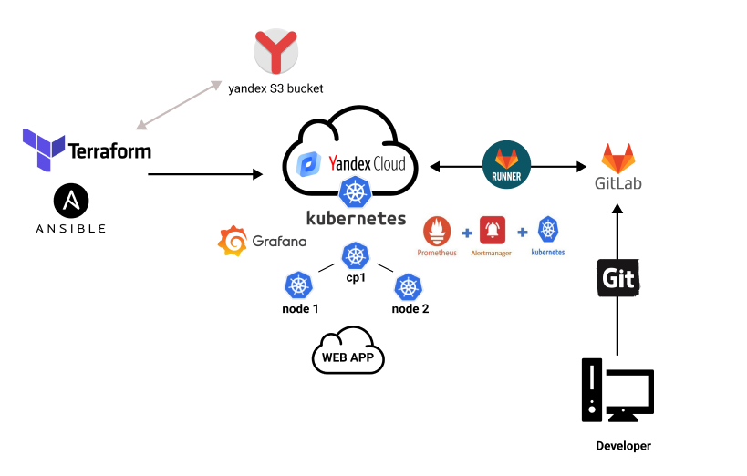
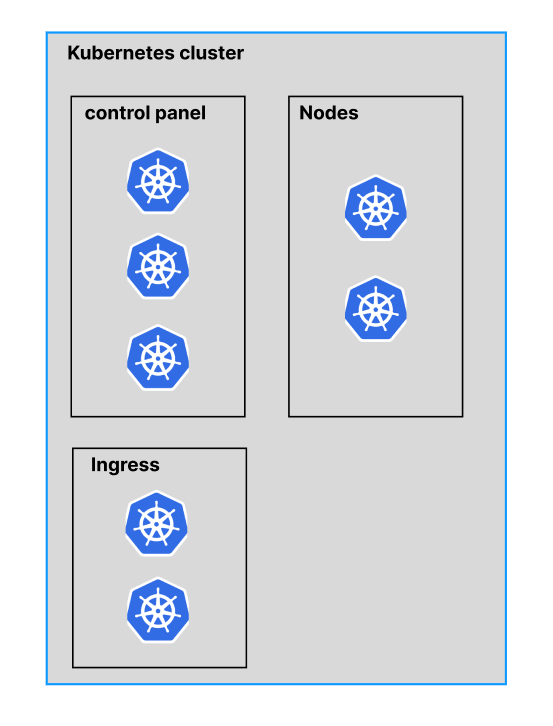

## План и схема работы
___

+ [Цель](#цель)
+ [Ресурсы](#ресурсы)
+ [Схема](#схема)
+ [Предпологаемая схема для боевой инфраструктуры (с минимальным набором и отказаустоичивостью)](#предпологаемая-схема-для-боевой-инфраструктуры-с-минимальным-набором-и-отказаустоичивостью)
#### Цель
---
После налаживания всех требуемых этапов, необходимо сформировать скрипт для автоматического выполнения всех описаных(созданных) шагов.
Выполнение операций будут производится на компьютере с ОС Linux Ubuntu 22.04 LTS.
Необходимые инструменты для работы:
+ Terraform
+ Python3
+ Ansible
+ Kubectl
+ Helm
---

#### Ресурсы

Из за ограниченности платного аккаунта будет реализована инфраструктура с минимальным набором ресурсов:

+ Будет установлена одна VPC + подсеть (192.168.10.0/24)
+ 3 VM (master + 2 Nodes)
+ ОС Ubuntu 20.04 LTS
+ CPU 2
+ ОЗУ 4 Гб
+ HDD 50Гб

#### Схема
---

В рамках дипломной работы будет реализована схема, указаная ниже:

---
#### Предпологаемая схема для боевой инфраструктуры (с минимальным набором и отказаустоичивостью)

В дипломной работе будет создаваться 3 машины, что в принцепе достаточно для эксперементов, но рисковано использовать в боевой инфраструктуре.
Также все сервисы создавались с типом `NodePort`. Предпологаю что в проде необходимо использовать `Ingress-Controller` и сервисы с типом `Ingress` + использование доменных имен для сервисов.
Исходя из всего выше сказанного вижу такую схему:

[На главную](../README.md)

