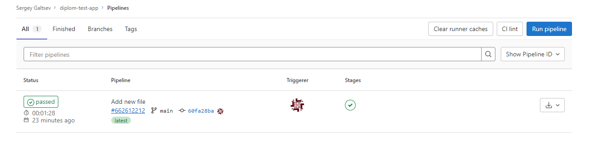
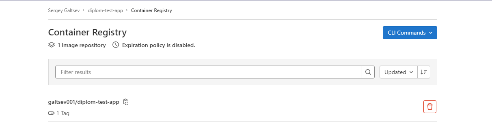
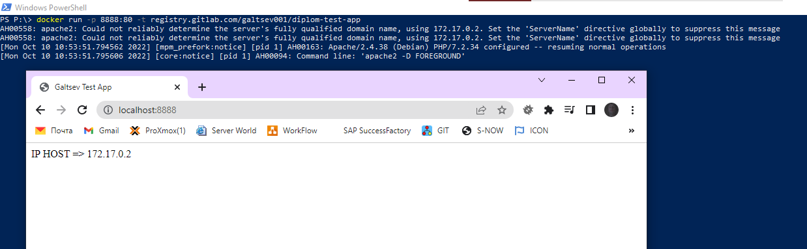

## Создание тестового приложения

* [Создание приложения](#создание-приложения) 
* [Создание .gitlab-ci.yml для регистрации приложения в Gitlab register](#создание-gitlab-ciyml-для-регистрации-приложения-в-gitlab-register) 
* [Проверка/Подключения образа локально](#проверкаподключения-образа-локально) 

##### Создание приложения

Для тестов был создан простой проект на `Gitlab`

Структура тестового приложения

```bash
src/index.php #Простая php страница отдающая ip сервера (возможно для проверки репликации)
Dockerfile #Инструкция по запуску php контейнера
README.md #файл описания проекта
```
Содержимое Dockerfile

```docker
FROM php:7.2-apache
COPY src/ /var/www/html/
EXPOSE 80
```

[Ссылка на проект](https://gitlab.com/galtsev001/diplom-test-app)

##### Создание .gitlab-ci.yml для регистрации приложения в Gitlab register

Далее необходимо зарегистрировать приложение к `gitlab` реестре docker контейнеров.
Для этого создаем простой `.gitlab-ci.yml`, который будет собирать образ и заливать его в реестр при каждом изменении проекта:

```yaml
build:
  image: docker:20.10.16
  stage: build
  services:
    - docker:20.10.16-dind
  script:
    - docker login -u $CI_REGISTRY_USER -p $CI_REGISTRY_PASSWORD $CI_REGISTRY
    - docker build -t $CI_REGISTRY/galtsev001/diplom-test-app:latest .
    - docker push $CI_REGISTRY/galtsev001/diplom-test-app:latest

```
Сохраняем изменения (коммит и пуш в гитлаб). Проверяем что все сработало:
+ Смотри как отработал наш pipeline (CI/CD -> Jobs)



+ Проверяем что приложение появилось в списках контейнеров (Packages and registers->Container Registry)




##### Проверка/Подключения образа локально

Проверим приложение что оно доступно и запускается.
Для этого подключим наш `gitlab.register`

```bash
docker login registry.gitlab.com
```
Вводим наши данные от `gitlab`, при успешном вводе получаем сообщение ввида `Success`
Пробуем запустить приложение локально:

```bash
docker run -p 8888:80 -t registry.gitlab.com/galtsev001/diplom-test-app
```



---

[На главную](../README.md)
